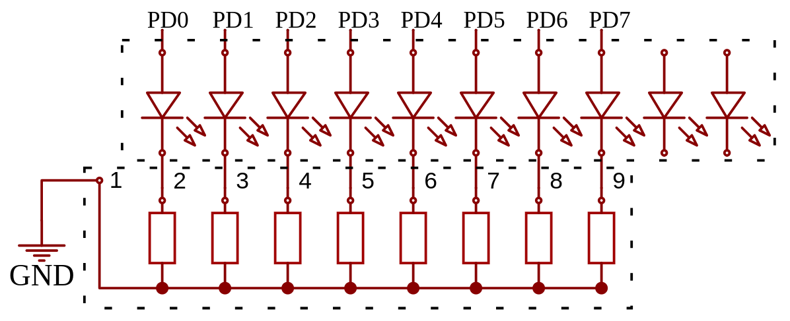
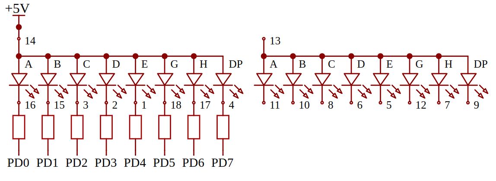

# Lab 1

## Exercise 1: Text to Morse code

Write a program translating text to Morse code. Input text should be read through UART and the output should be displayed on either the built-in LED (on *PB5*), or an external LED (remember about a resistor with appropriate resistance, e.g. $220 \Omega$ serially, without it the diode **might be damaged!**)

### Solution E1

The solution is in [`exercise1.c`](exercise1.c)

## Exercise 2: KITT lights

Connect a $220 \Omega$ resistor ladder and an LED bar graph like in the schematic below:



Be careful to connect the first pin of the ladder (designated with a dot) to GND, improper connection **may damage the LED ruler!**

With this setup achieve a scrolling LED effect like [KITT light](https://www.youtube.com/watch?v=54O_1mOab4Y) from "Knight Rider". Using pins from one port makes it easier because You can use bitwise operations to simplify operations. By default `PD0` and `PD1` pins are used by UART, so before using them for this exercise you may need to disable them for that purpose by using:

```c
UCSR0B &= ~_BV(RXEN0) & ~_BV(TXEN0);
```

**This will disble communication with the microcontroller by UART, and may prevent programming the microcontroller.** In that case you should disconnect a part of the circuit connected to these pins so it's not closed.

### Solution E2

The solution is in [`exercise2.c`](exercise2.c)

## Exercise 3: 0-9 Clock

Connect the 7-segment display [FJ5261B](https://documents.tme.eu/v7/_solaris-tep_/pVersion=0046&contRep=ZT&docId=005056AB752F1ED4999780C3FFA0C1EC&compId=LDD056BUE-101.pdf?ci_sign=e7374f177375dba15039bf7f7bea7e2fdb06efe0) as follows using $220 \Omega$ resistors, improper connection **may damage the display!**



Write a program that counts from 0 to 9 and displays the number using the display. Displaying the number should be done by writing once to the proper register, so the needed values for showing the numbers should be cached.

### Solution E3

The solution is in [`exercise3.c`](exercise3.c)

## Exercise 4: Arithmetic analysis

Write a program, which for all these types: (`int8_t`, `int16_t`, `int32_t`, `int64_t`, `float`), reads two number from UART and prints back results of operations of: addition, subtraction, multiplication and division.

Using `make lst` generate a `.lst` containing the result code saved in a format readable by humans. What can we say about the execution time and operation length for different types and operations? What parts represent which ones in C code? (Advanced assembly knowledge is not required).

*Note: UART 64-bit number transfer is not supported, so 32-bit input/output can be used for these data types. For floats you need to uncomment flags in the [Makefile](./Makefile) to properly handle them through UART.*

### Solution E4

The solution is in [`exercise4.c`](exercise4.c)

> **Source:**
> This list of problems was assigned as part of the *Embedded Systems* (SW) course in the 2025/26 Winter semester at University of Wrocław by [tilk](https://github.com/tilk)
