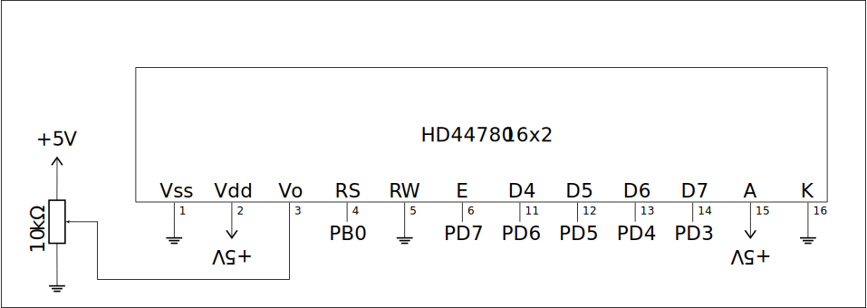
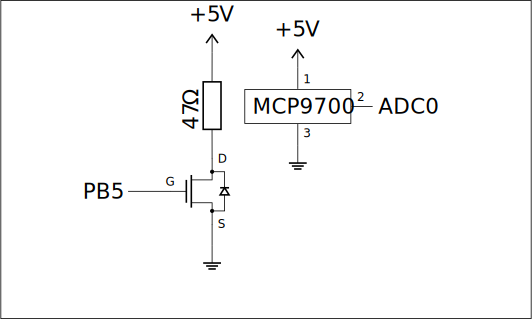
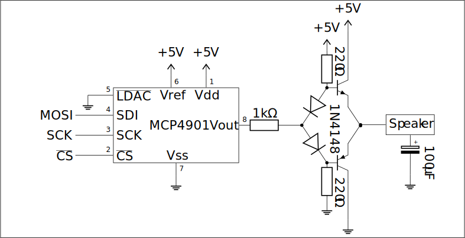

# Lab 10

> For exercises 1 and 2 functions handling communication with the HD44780 LCD from file `hd44780.h` and `hd44780.c` from [radzio.dxp.pl](https://radzio.dxp.pl/hd44780/hd44780_avr_4-bit_norw_c.htm) were used.

## Exercise 1: Scrolling LCD

Connect the [HD44780U](https://www.alldatasheet.com/datasheet-pdf/pdf/63663/HITACHI/HD44780U.html) *(or similar)* 16x2 character LCD display as follows if You wish to use the intended functions to handle communication:

  

It is advised to calibrate the contrast with the potentiometer to achieve good readability before starting any exercises with the display *(a poorly calibrated display may show nothing or black rectangles)*.

Write a program displaying characters received through UART. Use the hardware cursor to show where the next character will appear. Inputting an endline character or filling the line should have a scroll function – either go to the next line or clear the first line and **move the second line** to the first one.

### Solution E1

The solution is in [`exercise1.c`](exercise1.c)

## Exercise 2: LCD Progress bar

Implement a horizontal progress bar with the HD44780U 16x2 character LCD display. 81 different states should be possible with custom characters being 0 to 5 filled columns. To achieve this, check the datasheet on how to program and use custom characters.

> Hints: Look for CGRAM, and check tables 4, 5 and 6

### Solution E2

The solution is in [`exercise2.c`](exercise2.c)

## Exercise 3: Bang-bang temperature control

Using an integrated temperature sensor [MCP9700](https://www.alldatasheet.com/datasheet-pdf/pdf/109863/MICROCHIP/MCP9700.html), [IRF520](https://www.alldatasheet.com/datasheet-pdf/pdf/22389/STMICROELECTRONICS/IRF520.html) MOSFET and a $47\Omega$ resistor build the following system so the resistor case **physically touches** the temperature sensor's case:

  

Make sure to connect the temperature sensor correctly *(check the datasheet to determine pin numbers depending on package type)*. **Improper connections may damage the device!**

The resistor functions as a heater with $0.5\text{W}$ of power. Write a program that controls the heater and stabilizes the temperature measured by the sensor using te following [Hysteresis](https://en.wikipedia.org/wiki/Hysteresis):

- Turn on the heater and wait until the temperature reaches set value $\text{T}$
  
- Turn off the heater and wait until the temperature falls to temperature $\text{T} - \text{T}_\text{h}$ with $\text{T}_\text{h}$ being a small positive constant.

Use the built-in reference $1.1\text{V}$ to minimize supply voltage uncertainty on measurements from the sensor. The program should provide communication through UART *(setting the value $\text{T}$, reporting the measured temperature)*

> Note: Beacause of high currents voltages on the whole board may drop, so You should use the Vin and a second GND pins to connect this system if systems of other exercises are also connected. If not, the ATmega328P may go into **brownout** behaving weirdly (transactions starting and not finishing, blinking power LED)

### Solution E3

The solution is in [`exercise3.c`](exercise3.c)

## Exercise 4: Speaker melody

GPIO pins of the ATmega328P can't provide enough current for the $8\Omega$ speaker to function loudly enough, so we need to build a simple **transistor amplifier**, use [1N4148](https://www.alldatasheet.com/datasheet-pdf/pdf/15021/PHILIPS/1N4148.html) diodes, bipolar transistors NPN [BC547](https://www.alldatasheet.com/datasheet-pdf/pdf/11551/ONSEMI/BC547.html) and PNP [BC557](https://www.alldatasheet.com/datasheet-pdf/pdf/16103/PHILIPS/BC557.html) and the [MCP4901 DAC](https://ww1.microchip.com/downloads/aemDocuments/documents/OTH/ProductDocuments/DataSheets/22248a.pdf):

  

As always, capacitors and the DAC need to be **connected correctly**.

Write a program that plays a sampled melody on the speaker.

### Solution E4

The solution is in [`exercise4.c`](exercise4.c)

> **Source:**
> This list of problems was assigned as part of the *Embedded Systems* (SW) course in the 2025/26 Winter semester at University of Wrocław by [tilk](https://github.com/tilk)
