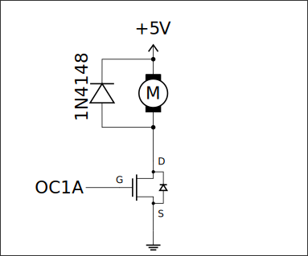
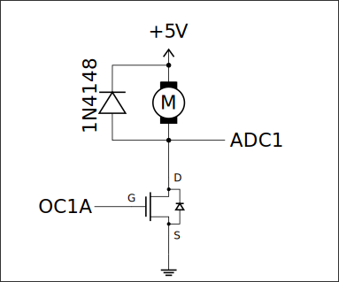

# Lab 11

## Exercise 1: Basic DC motor control

Build the following system using a [IRF520](https://www.alldatasheet.com/datasheet-pdf/pdf/22389/STMICROELECTRONICS/IRF520.html) MOSFET and a MT62-like DC motor *(Couldn't find the datasheet)*:

  

Control the motor speed using a PWM signal with a frequency $\leq 1\text{kHz}$. Use the potentiometer value measured by the ADC to control the PWM duty cycle and, consequently, the **motor speed**.

### Solution E1

The solution is in [`exercise1.c`](exercise1.c)

## Exercise 2: DC motor measurements

Use the *Phase and Frequency Correct PWM* mode of Counter 1 (with `ICR1` as the `TOP` value) to control the DC motor same as in Exercise 1. In this mode, the counter works bidirectionally - the counter value alternately increases to the maximum value and decreases to the minimum value. In this mode the extremes are reached in the **middle** of the square wave pulse, connect the junction between the motor and MOSFET with the ADC, like this:

  

With this connection we can measure useful properties of the motor:

- When the MOSFET is closed electromotive force of the motor can be measured. Difference between $5\text{V}$ nd the measured voltage is linearly proportional to the motor's rotational speed.

- When the MOSFET is closed the current passing through the motor can be measured. The voltage across the measured voltage is linearly proportional to the current flowing through the motor, and therefore to the motor torque.

Use proper interrupts (`OVF` and `CAPT`) to start ADC conversions in the middle of the MOSFET being open/closed to get the most accurate readings. Communicate the results through UART.

### Solution E2

The solution is in [`exercise2.c`](exercise2.c)

## Exercise 3: Two-way motor driver

Use the [L293D](https://www.ti.com/lit/ds/symlink/l293.pdf) DC motor driver to be able to move the engine in **two directions**. The engine should be connected as shown in Figure 10. of the datasheet while omitting the diodes *(L293D has built-in diodes)*. As always **improper connections may damage the driver!** As in Exercise 1 a potentiometer should control the speed of the motor, but now rotation in two directions should be possible *(When the potentiometer is set to the middle the motor should stop)*.

### Solution E3

The solution is in [`exercise3.c`](exercise3.c)

## Exercise 4: Basic servo system control

> I don't know what servo we used, it's not provided as a specific part

Write a program that uses a PWM signal to control a modeling servo. The servo deflection is **proportional** to the PWM duty cycle with a frequency of $50\text{kHz}$. The desired servo position should be set by a potentiometer connected to ADC.

Avoid extreme deflections of the servo by clamping the values from the potentiometer to the servo's extremes. Additionally quick motions of the servo require a lot of current, which may reset the ATmega328P, to remedy this connect a $100\mu\text{F}$ capacitor between the servo's supply voltage and ground wires.

### Solution E4

The solution is in [`exercise4.c`](exercise4.c)

> **Source:**
> This list of problems was assigned as part of the *Embedded Systems* (SW) course in the 2025/26 Winter semester at University of Wrocław by [tilk](https://github.com/tilk)
