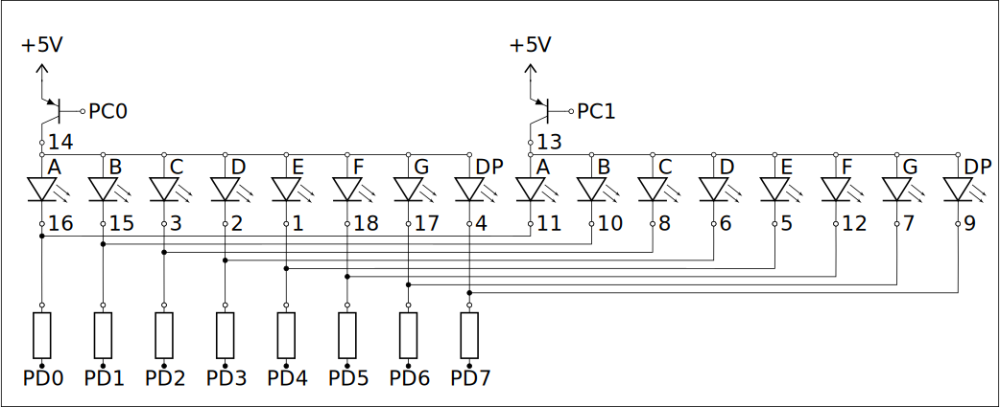

# Lab 2

## Exercise 1: Press delay

Build and program a system which *remembers* presses and releases of a button by a user and enables/disables an LED with a **1 second delay**. The program should remember the state of presses with a *reasonable* time precision, the durations of presses should be preserved (with a constant precision e.g. $\frac{1}{100}s$).

> Hint: You can easily implement this with a [cyclic buffer](https://en.wikipedia.org/wiki/Circular_buffer)

### Solution E1

The solution is in [`exercise1.c`](exercise1.c)

## Exercise 2: Morse code to Text

Write a program that translates Morse code to text. The input codes should be read from a single button. Distinction between *dits* and *dahs* should be done based on time pressed, similarly to breaks between characters and words. Received transmission should be transferred through UART (you may use [ANSI escape codes](https://en.wikipedia.org/wiki/ANSI_escape_code) to prettify the transmission state), with an LED signal crossing time thresholds (like a press being interpreted as a *dah* instead of a *dit*).

### Solution E2

The solution is in [`exercise2.c`](exercise2.c)

## Exercise 3: Gray codes

Build and program a system with an LED bar graph (wired the same way as in [Lab 1 Exercise 2](../Lab%201/README.md#exercise2:-KITT-lights)) and three buttons that displays different [Gray codes](https://en.wikipedia.org/wiki/Gray_code). The first one should reset the state (disable all LEDs), the other two – toggle to the next/previous code (and display it on the bar graph). The codes should loop (e.g. enough changes to the next state should reach the starting state). Take care of debouncing – one button press should always result in one code change.

> Hint: Gray codes are easily calculated with bitwise operations, so by using one port you can set the states to the code

### Solution E3

The solution is in [`exercise3.c`](exercise3.c)

## Exercise 4: 0-99 Clock

Build a multiplexed two-number display using the schematic below:

  

Using $220 \Omega$ resistors. The transistors on the schematics are PNP transistors (we used [BC557](https://www.onsemi.com/pdf/datasheet/bc556b-d.pdf)), which should be connected correspondingly to their datasheet. Improper connection **may damage the transistors!**

Use this system to build a clock counting from 0 to 99 each second and **resetting** when it reaches the upper value.

### Solution E4

The solution is in [`exercise4.c`](exercise4.c)

> **Source:**
> This list of problems was assigned as part of the *Embedded Systems* (SW) course in the 2025/26 Winter semester at University of Wrocław by [tilk](https://github.com/tilk)
