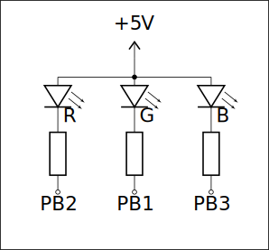
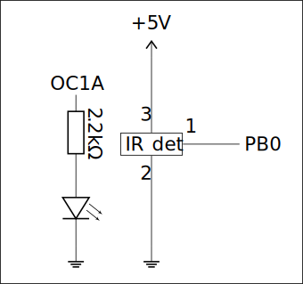

# Lab 4

## Exercise 1: Types operation times

Write a program that for each of the types: (`int8_t`, `int16_t`, `int32_t`, `int64_t`, `float`), uses a hardware clock to measure the times of: addition, subtraction, multiplication and division. Compile the program using **optimization flags**, but make sure that your program actually measures the operation times, maybe with some memory access operations. You can use the `volatile` keyword to force reads and writes on a variable. You can also do operations in functions in a different file than the testing one. The difference between measured and theoretical values should be controlled by a low constant *(preferably 0)*.

### Solution E1

The solution is in [`exercise1.c`](exercise1.c)

## Exercise 2: Photoresistor light inversion

Use a [photoresistor](https://www.tme.eu/Document/f2e3ad76a925811312d226c31da4cd7e/LDR07.pdf) to measure the intensity of light. Using a hardware clock, change the brightness of an LED **inversely** to the light's intensity: the brigher the light, the darker should the LED glow.

### Solution E2

The solution is in [`exercise2.c`](exercise2.c)

## Exercise 3: Breathing LED

Build and program a system of a "breathing" (smooth fade in and fade out) RGB LED. Use hardware timers to modulate the LED brightness. Notes:

- When connecting the RGB LED remember to use resistors with **each** of the constituent LEDs *(the longest leg is the common anode)*. Proposed wiring:

  

- The color for each "breath" should be chosen randomly. Choosing the values of RGB a random is a poor method of picking a color – it often leads to unsaturated or dim colors. Randomizing only the H part of the HSV system leads to better results.

- The change in brightness should seem to be sinusoidal. Remember that a human eye sees light [**logarithmically**](../Lab%203/README.md#exercise-3-gradual-led-control). This also applies to color perception, not taking this into account may lead to most colors looking close to CMY.

- Avoid operations `float` and `double` types. A function for the fill of PWM can be tabularized, and color selection computed using only integers.

### Solution E3

The solution is in [`exercise3.c`](exercise3.c)

## Exercise 4: IR proximity sensor

Using an IR LED and an [integrated IR detector](https://www.tme.eu/Document/777fdf21e0fba3fd5c036ef95756460c/OSRB38C9BA.pdf) build and program a system along with the schematic below. Check the connections thoroughly and consult the datasheet – improper detector connection **may lead to its damage!**

  

Build the system so the IR LED isn't directly visible to the IR detector, it should only react to reflected light.

Program the microcontroller to act as a proximity sensor – a visible LED should enable when a hand is placed close to the detector. The detector reacts best to frequencies close to $37.9\text{kHz}$, transmitted in pulses (e.g. lasting $600\mu\text{s}$). Use a hardware clock to achieve this frequency, dividing into pulses can be done in any way.

The detector **won't** react to a constant signal, read the datasheet to find the specific pattern required.

### Solution E4

The solution is in [`exercise4.c`](exercise4.c)

> **Source:**
> This list of problems was assigned as part of the *Embedded Systems* (SW) course in the 2025/26 Winter semester at University of Wrocław by [tilk](https://github.com/tilk)
