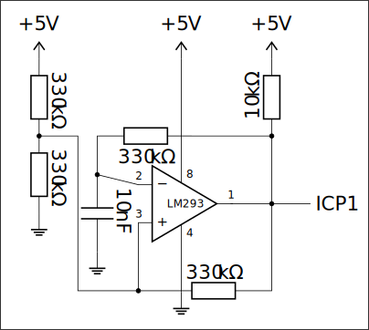

# Lab 5

## Exercise 1: Press delay with interrupts

Build and program a system achieving the same effect as in [Lab 2 Exercise 1](../Lab%202/README.md#exercise-1-press-delay): a system enables/disables an LED with a **1 second delay** upon pressing/holding a button. Program logic (including button readings) should reside in interrupt handlers for the hardware clock. The main loop should **only** put the MCU into sleep mode.

### Solution E1

The solution is in [`exercise1.c`](exercise1.c)

## Exercise 2: Light measurement button

Write a program that measures a photoresistor's resistance  using the ADC when a button is pressed, and transmits the last measured value through UART in regular intervals (even when the button is not pressed). Write a program so that:

- Printing the last value is done in the main loop

- The measurement is initiated by external interrupt 0, or by ADC Auto Trigger (better), or in the ADC interrupt handler

- measurement result should be saved in the ADC interrupt handler

### Solution E2

The solution is in [`exercise2.c`](exercise2.c)

## Exercise 3: ADC noise reduction

Write a program than demonstrates the effect of **ADC Noise Reducion** sleep mode on the precision of ADC measurements. Configure the ADC to measure built-in reference $1.1\text{V}$ using supply voltage **Aref**. In the program perform two sets of measurements using the ADC: one with ADC Noise Reduction and sleeping, the other with polling. For both sets compute the variance of measurements. *Using the Noise Reduction mode requires configuring the SMRC register, enabling ADC interrupts and sleeping after starting the conversion.*

### Solution E3

The solution is in [`exercise3.c`](exercise3.c)

## Exercise 4: Frequency measuring

Using a [LM293 comparator](https://www.ti.com/lit/ds/symlink/lm2903-n.pdf?ts=1771139109919) build the following oscillator system:

  

Make sure to connect supply voltage and ground properly. Pin 1 in DIP cases is typically marked with a dot, pins are counted counterclockwise. **Improper connections may damage the comparator!**

Frequency generated by this system should be between $190\text{Hz}$ and $250\text{Hz}$ *(most likely close to $218\text{Hz}$)*. Using the Input Capture function of the microcontroller's Clock 1 measure this frequency. The program's logic should be done in interrupt handlers, the main loop should **only** put the MCU into sleep mode.

### Solution E4

The solution is in [`exercise4.c`](exercise4.c)

> **Source:**
> This list of problems was assigned as part of the *Embedded Systems* (SW) course in the 2025/26 Winter semester at University of Wrocław by [tilk](https://github.com/tilk)
