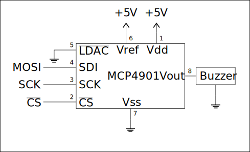
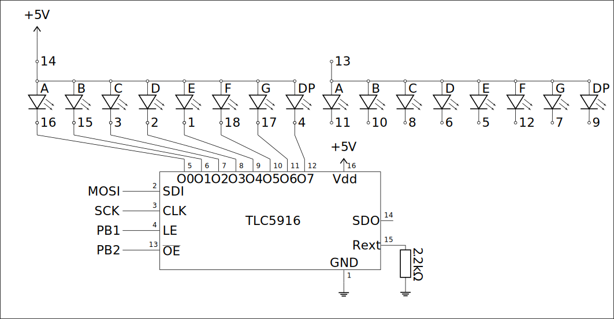

# Lab 6

## Exercise 1: UART echo

Write the simplest program that performs an "echo" function through UART: every received character received by the microcontroller should be returned to sender.
Don't use functions from the C standard library (`printf`, `scanf`, `getchar` etc.). Use interrupts, the main loop should **only** put the MCU into sleep mode, choose the mode so that UART is still enabled.

### Solution E1

The solution is in [`exercise1.c`](exercise1.c)

## Exercise 2: UART with interrupts

The simplest UART in/out implementation uses active waiting *(polling)*, which has many cons. During transmitting and receiving the processor spends most of the time checking a status bit, and receiving works **only** when the program is actively trying to read. Fix these issues by implementing an **interrupt-based** solution using cyclic buffers for transmitting and receiving.

Write `USART_RX` and `USART_UDRE` interrupt handlers and new implementations of `uart_transmit` and `uart_receive` which avoid polling. The transmitting function may poll **only** when its buffer is full, whereas the receiving function only when its buffer is empty. Remember about proper synchronization of these functions by using interrupt masking.

### Solution E2

The solution is in [`exercise2.c`](exercise2.c)

## Exercise 3: DAC transceiver melody

Build and program a system using a [MCP4901 DAC](https://ww1.microchip.com/downloads/aemDocuments/documents/OTH/ProductDocuments/DataSheets/22248a.pdf). Make sure to connect the DAC correctly. The 1 pin is marked with a dot, the other pins are pins are counted counterclockwise. **Improper connections may damage the DAC!**

<p align="center">
  
</p>

Save a short, single-channel audio file as a string of samples, using a low sampling frequency (e.g. 8 kHz). Place the file in program *(flash)* memory. The provided `sound.c` can be used, but a new one can be created with the following commands:

```bash
ffmpeg -i sound.wav -f u8 -ar 8000 -ac 1 -acodec pcm_u8 sound.raw
xxd -i dzwiek.raw dzwiek.c
```

Play the sound using the DAC system controlled through the SPI transceiver.

Uploading a new sample to MCP4901 consists of: changing the state of the $\overline{\text{CS}}$ wire to low, sending two bytes using SPI *(w trybie CPOL=0 CPHA=0)* as in the datasheet. Changing the state of $\overline{\text{CS}}$ to high. To properly send data to the MCP4901 its datasheet should be read – in particular the $\overline{\text{GA}}$ *(Gain should be set to 1x)* and $\overline{\text{SHDN}}$ *(Output should be available)*.

### Solution E3

The solution is in [`exercise3.c`](exercise3.c)

## Exercise 4: 0-9 Clock with LED driver

Build the following system using a 7-segment display and a [TLC5916](https://www.ti.com/lit/ds/symlink/tlc5917.pdf) LED driver. Display numbers 0 to 9, changing every second. Use the SPI transceiver to control the LED driver. As always, **improper connections may damage the driver!**

<p align="center">
  
</p>

Control the system as follows:

- After sending the LED states using SPI send a short pulse to the LE pin. The state of LEDs is loaded from the register after the falling edge

- High state on the  $\overline{\text{OE}}$ pin disables LEDs

Consult the datasheet for further information.

### Solution E4

The solution is in [`exercise4.c`](exercise4.c)

> **Source:**
> This list of problems was assigned as part of the *Embedded Systems* (SW) course in the 2025/26 Winter semester at University of Wrocław by [tilk](https://github.com/tilk)
