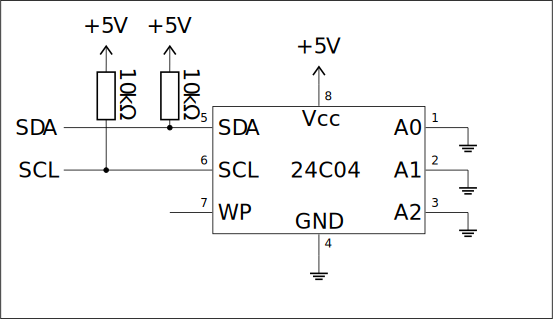
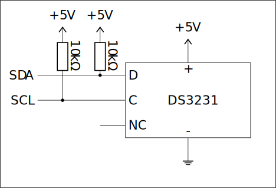

# Lab 7

> For exercises 1 and 2 functions handling the $\text{I}^2\text{C}$ protocol from file `i2c.h` and `i2c.c` of "Make: AVR Programming" were used. For obvious resons I didn't provide them in this repo.

## Exercise 1: Simple $\text{I}^2\text{C}$ EEPROM communication

Connect the [24C04](https://datasheet.octopart.com/24C04WP-STMicroelectronics-datasheet-21183101.pdf) $\text{I}^2\text{C}$ EEPROM to the microcontroller as shown below. As always, **improper connections may damage the device!**

  

Implement a program which allows reading and writing data from/to the system. You may use `i2c.h` and `i2c.c` from the "Make: AVR Programming" book. Communication with the program should be available through UART, handle the following commands:

- **read `addr`** - read a byte from address **`addr`**

- **write `addr` `val`** write the value **`val`** to address **`addr`**

### Solution E1

The solution is in [`exercise1.c`](exercise1.c)

## Exercise 2: Advanced $\text{I}^2\text{C}$ EEPROM communication

Extend the program from the previous exercise with the following commands:

- **read `addr` `len`** - read **`len`** bytes starting from address **`addr`**, output in [I8HEX](https://en.wikipedia.org/wiki/Intel_HEX#Named_formats) format
- **write** - write data, the following lines should contain data in I8HEX format

Minimize the amount of $\text{I}^2\text{C}$ transactions by performing **sequential** reads and writes during one transaction. *Note* that **sequential** reads and writes differ in behavior:

- reads automatically increment the internal address counter up to the last one, at which point the address will wrap arount to 0
- writes are able to write up to one page during a transaction *(in 24C04 16 bytes)*. When the address counter would increment to the next page, it wraps around to the start of the page *(so only the 4 least significant bits of address change)*.

You can encode and decode files to/from the I8HEX format using `srec_cat`. The program shouldn't restrict the commands in any way, in particular reading/writing the **whole system** should be possible in one command.

### Solution E2

The solution is in [`exercise2.c`](exercise2.c)

## Exercise 3: $\text{I}^2\text{C}$ Real-time clock

Connect the [DS3231](https://www.analog.com/media/en/technical-documentation/data-sheets/ds3231.pdf) $\text{I}^2\text{C}$ real-time clock to the microcontroller as shown below. *(Pins are labeled on the system)*. As always, **improper connections may damage the device!**

  

Implement a program which allows reading and writing date and time from/to the system. Communication with the program should be available through UART, handle the following commands:

- **date** - read the date *(in DD-MM-YYYY format)*
- **time** - read the time *(in HH:MM:SS format)*
- **set date `DD-MM-YYY`** - set the date
- **set time `HH:MM:SS`** - set the time

*Note* that the DS3231 sytem encodes date and time in the [BCD](https://en.wikipedia.org/wiki/Binary-coded_decimal) format. It allows for easy conversion to other notations *(ASCII)*. That means You shouldn't use division or modulo for the converion.

### Solution E3

No solution available.

## Exercise 4: $\text{I}^2\text{C}$ Bit-banging

SPI bus signals can be generated "manually" in the program with GPIO pins, this is called *bit-banging*. Connect the MISO, MOSI, SCK, SS pins with other chosen GPIO pins. Configure the hardware SPI driver to work as an SPI slave. Write a program that works as an SPI master by *bit-banging* and communicates with the hardware SPI driver e.g. by transferring numbers between each other. Report this communication through UART.

### Solution E4

The solution is in [`exercise4.c`](exercise4.c)

> **Source:**
> This list of problems was assigned as part of the *Embedded Systems* (SW) course in the 2025/26 Winter semester at University of Wrocław by [tilk](https://github.com/tilk)
